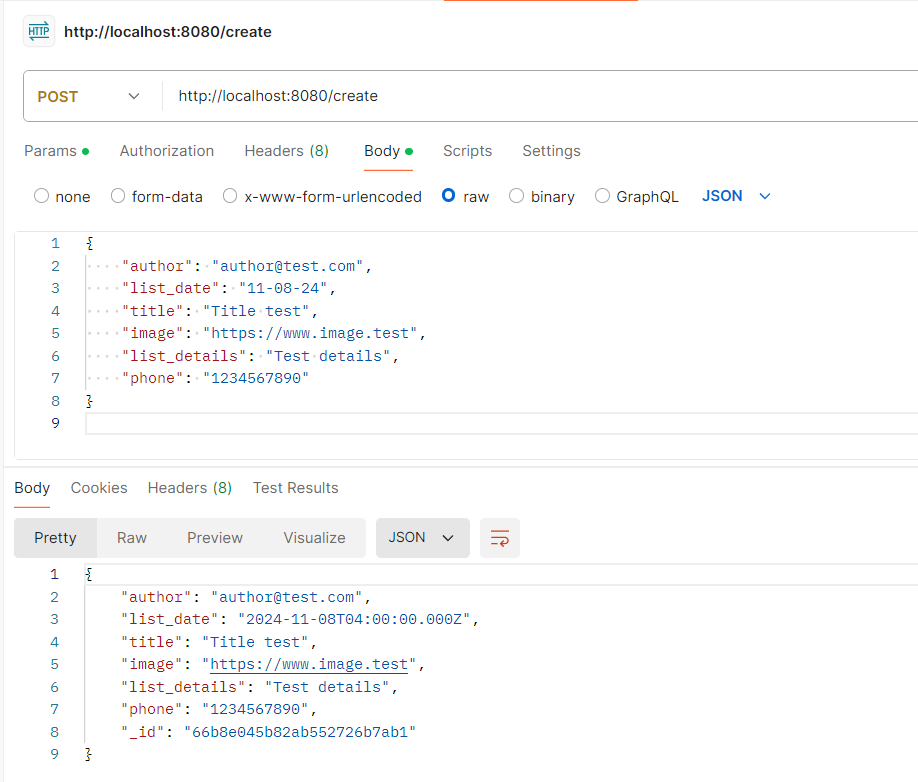
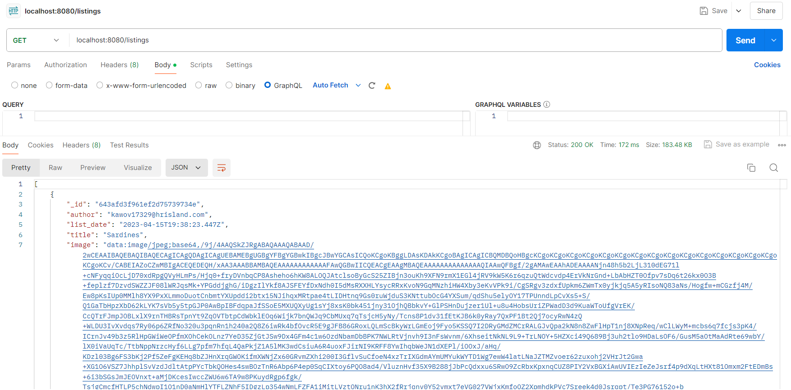
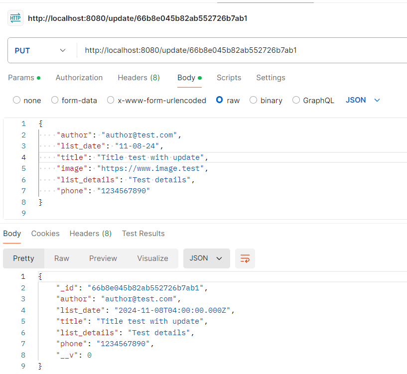

## Stack used 
1. MongoDB / Mangoose
1. ExpressJS
1. NodeJS

## Sample MongoDB Document 
{"_id":{"$oid":"643964d9b3fbb93561826666"},
  "author": "InMada",
  "list_date": "14 Sept 2016",
  "title":"Canned oranges",
  "image": "https://www.thespruceeats.com/thmb/07hPbfbLKRSyL8KxisdF5M5Nrrk=/1500x0/filters:no_upscale():max_bytes(150000):strip_icc()/canned-mandarin-oranges-58a47a285f9b58819c966c81.jpg",
  "list_details": "Canned oranges from Walmart, expire May 20"
}

# Commands for CRUD operations
## Create
`db.collection.save()`: Performs an insert if the document passed to the method does not contain the _id field.

## Read
`db.collection.find()`: Executes a query and returns the first batch of results.

## Update
`db.collection.save()`: Performs an update with upsert:true when the document contains an _id field.

## Delete
`db.collection.deleteOne()`: Delete at most a single document that match a specified filter even though multiple documents may match the specified filter.

# References
[MongoDB](https://www.mongodb.com/docs/manual/crud/)

# API testing with Postman
1. Creating a new document

1. Reading all documents

1. Update a document

1. Dete a document

# How to run in on your computer
1. Clone this repository with the command `git clone https://github.com/haingo-raz/Food-Van-API.git`.
1. Install the required libraries by running the command `npm install`.
1. Set up a database with a collection called 'Listings' that have the same properties as the sample document above.
1. Create a .env file by following the .env.example file and add your MongoDB username, password, database name, and app name.
1. To run the server, use the command `npm run dev`.